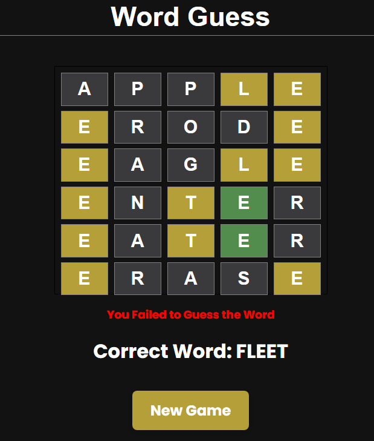

## Word Guess

WordGuess is an interactive word-guessing game built using ReactJS. Test your vocabulary and deduction skills by trying to guess the hidden word within a limited number of attempts.

<div align="center">
  
  
</div>

### Technologies Used

```md
- HTML
- CSS
- Flexbox
- JavaScript
- ReactJS
- npm
- Yarn
```

<hr>

### Gameplay

Welcome to the engaging word guessing game! Here's how to play:

**_1. Objective:_** Your goal is to uncover a secret word hidden behind a series of empty boxes.
You'll do this by guessing individual letters to fill in the boxes and ultimately reveal the complete word.

**_2. Guessing Letters:_** Begin by guessing a letter from the alphabet. Type in your chosen letter, and the game will process your input.

**_3. Letter Feedback:_**

- **_Green Boxes:_** If a box turns green after you've guessed a letter, it means that the letter is present in the secret word, and it's in the correct position.

- **_Yellow Boxes:_** A yellow box indicates that the guessed letter is indeed in the secret word, but it's positioned differently than where you placed it.

- **_Grey Boxes:_** If a box remains grey, it signifies that the guessed letter is not present in the secret word at all.

- **_Filling in the Word:_** As you guess letters, correctly guessed ones will be filled into their respective boxes based on the feedback provided. This gradually unveils the mystery word.

**_4. Limited Attempts:_** Be cautious! You have a set number of attempts to guess the entire word correctly. If you exceed this limit without revealing the word, the game concludes.

**_5. Winning the Game:_** You emerge victorious by successfully guessing the complete secret word before utilizing all your allotted attempts.

**_6. Challenge Yourself:_** The game's challenge lies in deducing the word within the given attempts, using the feedback from the coloured boxes to guide your choices.

Now, immerse yourself in the exciting world of word guessing and put your language skills to the test! Good luck, and have fun uncovering the hidden words.

<hr>

### Installation

Install the dependencies using npm or Yarn:

```
yarn install
```

Start the development server:

```
yarn start
```
